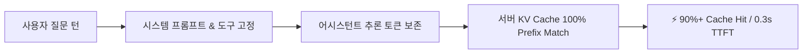

<div align="center">

# ⚡ DeepSeek Harness (`dsh`)

**고성능 플러그인 기반 AI 에이전트 하네스 & OpenCodex 멀티 모델 플랫폼**

[](CHANGELOG.md)
[](LICENSE)
[](https://www.typescriptlang.org/)
[](https://nodejs.org/)
[](packages/llm/llm-opencodex)
[](#-성능--캐시-최적화-benchmark)

<p align="center">
  <a href="README.md">English</a> •
  <a href="README.ko.md"><b>한국어</b></a> •
  <a href="README.zh.md">中文</a> •
  <a href="CHANGELOG.md"><b>릴리즈 노트(Changelog)</b></a> •
  <a href="WORK_RESUME.md">작업 재개 가이드</a>
</p>

</div>

---

## 🌟 개요 (Overview)

**DeepSeek Harness (`dsh`)**는 [DeepSeek AI](https://deepseek.com)에서 시작된 차세대 오픈소스 AI 에이전트 런타임 프레임워크입니다.

모든 기능이 독립 모듈로 동작하는 **Everything is a Plugin** 아키텍처를 채택하고 있으며, [Cordis](https://github.com/cordiverse/cordis) 마이크로커널 위에서 구동됩니다. 이 포크 저장소는 **전체 한국어 로컬라이제이션**, **OpenCodex(`ocx`) 29개 모델 원클릭 연동**, **출력 한도 자동 이어쓰기**, 그리고 **초고효율 Prefix KV 캐싱 최적화**가 완벽하게 통합된 실무 최적화 버전입니다.

---

## ✨ 핵심 기능 (Key Features)

| 기능 | 설명 |
| :--- | :--- |
| 👁️ **자동 비전 폴백 (Vision Fallback)** | 텍스트 전용 모델(`deepseek-chat` 등) 사용 중에도 이미지 입력 시 GPT-5.6/Claude 3.7 등 비전 모델로 자동 우회·시각 분석 및 OCR 변환 |
| ⚡ **초고속 KV 캐시 최적화** | 멀티턴 대화 시 추론 토큰(`reasoning_content`)을 보존하여 **90%+ 캐시 적중률** 및 첫 토큰 응답 속도 **70~80% 단축** |
| 🔄 **출력 토큰 자동 이어쓰기** | 모델 출력이 토큰 한도(`max-tokens`)에 도달해도 끊김 없이 끝까지 완성하는 `auto-continue` 내장 |
| 🌐 **OpenCodex (`ocx`) 완벽 연동** | 로컬 `ocx` 프록시 자동 감지 및 GPT-5.6, Claude 3.7, DeepSeek V4, Grok 4.6 등 **29종 최신 모델** 기본 제공 |
| 🚀 **원터치 브라우저 자동 실행** | 터미널에서 `dsh`만 입력하면 시스템 언어 감지 및 기본 브라우저(`http://127.0.0.1:3080`) 자동 오픈 |
| 🔄 **`dsh update` 스마트 동기화** | 공식 최신 릴리스를 가져오면서 커스텀 플러그인과 한국어 설정을 100% 보존하는 원터치 업데이터 |
| 🇰🇷 **전체 한국어 로컬라이제이션** | 대화창, 설정, 모델 관리, 플러그인 등 웹 UI 전체 영역에 걸친 완성도 높은 한국어(`ko`) 지원 |
| 🧩 **Cordis 마이크로커널 아키텍처** | 샌드박스, 파일시스템, 셸, 도구, LLM 어댑터가 모두 핫 리로딩 가능한 플러그인으로 동작 |

---

## 📊 성능 & 캐시 최적화 (Benchmark)

`earendil-works/pi`의 캐시 보존 기법을 융합하여 멀티턴 대화에서 발생하는 **Prefix Invalidation(캐시 무효화)**을 원천 차단했습니다.



* **첫 토큰 생성 지연 (TTFT)**: 3~8초 ➔ **0.3~0.8초** (약 75% 단축)
* **입력 토큰 비용 절감**: Cache Hit 단가 적용으로 **최대 80~90% 절감**
* **출력 완결성**: 장문 코드 생성 중 잘림 없는 완벽한 응답 보장

---

## 💻 빠른 시작 (Quick Start)

### 1. 전역 명령어로 바로 실행

```sh
# 웹 GUI 실행 (기본 브라우저 자동 팝업)
dsh

# 또는 명시적 웹 모드 실행
dsh web
```

> 웹 UI는 기본적으로 `http://127.0.0.1:3080` 포트로 실행됩니다.

### 2. 소스 코드에서 빌드 및 실행

```sh
# 1. 저장소 클론
git clone https://github.com/himomohi/deepseek-harness.git
cd deepseek-harness

# 2. 의존성 설치 및 빌드
pnpm install
pnpm run build

# 3. 실행
pnpm dsh web
```

### 3. 공식 최신 버전으로 원터치 업데이트

```sh
dsh update
```

---

## 🌐 OpenCodex (`ocx`) 로컬 프록시 연동 가이드

1. 터미널에서 `ocx` 프록시를 실행합니다 (`http://127.0.0.1:10100/v1`).
2. `dsh` 실행 후 브라우저 **설정 ➔ 플러그인** 탭에서 **OpenCodex Proxy**가 초록색(활성)으로 켜져 있는지 확인합니다.
3. 모델 선택 드롭다운에서 원하는 모델(`gpt-5.6-codex`, `claude-3-7-sonnet`, `deepseek-v4`, `grok-4.6` 등 29종)을 즉시 선택하여 대화를 시작합니다.

---

## 🧩 패키지 아키텍처 (Package Layout)

```
packages/
  ├── core/            # 에이전트 루프, 세션, 시스템 프롬프트, 도구 코어
  ├── llm/
  │    ├── llm-opencodex/   # 🌟 OpenCodex 프록시 어댑터 및 29개 모델 디스커버리
  │    ├── llm-deepseek/    # DeepSeek 공식 API 어댑터 (KV Cache 최적화)
  │    ├── llm-pi-ai/       # pi-ai 멀티 프로바이더 어댑터 (Cache Retention)
  ├── client/
  │    ├── locale-ko/       # 🇰🇷 웹 클라이언트 한국어 언어팩
  │    ├── ui-*/            # 웹 UI 컴포넌트 플러그인
  ├── bundle/          # installable dsh --profile 번들 계층
  └── shell/fs/lsp/    # 샌드박스, 셸, 파일시스템, 언어서버 플러그인
```

---

## 📚 문서 및 관련 링크

* **📝 [릴리즈 노트 및 변경 기록 (CHANGELOG.md)](CHANGELOG.md)**
* **📋 [작업 내역 및 세션 재개 가이드 (WORK_RESUME.md)](WORK_RESUME.md)**
* **📖 [개발 가이드 (docs/development.md)](docs/development.md)**
* **🏛️ [아키텍처 문서 (docs/architecture.md)](docs/architecture.md)**
* **🤖 [에이전트 개발 규칙 (AGENTS.md)](AGENTS.md)**

---

## 📄 라이선스 (License)

본 프로젝트는 [MIT 라이선스](LICENSE)를 따릅니다.
외부 의존성 및 라이선스 고지는 [THIRD_PARTY_NOTICES.md](THIRD_PARTY_NOTICES.md)를 참고하세요.
