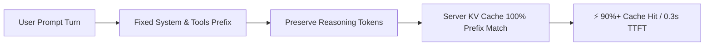

<div align="center">

# ⚡ DeepSeek Harness (`dsh`)

**High-Performance Plugin-Based AI Agent Harness with OpenCodex & Multi-Model Support**

[](CHANGELOG.md)
[](LICENSE)
[](https://www.typescriptlang.org/)
[](https://nodejs.org/)
[](packages/llm/llm-opencodex)
[](#benchmark)

English | [中文](README.zh.md) | [한국어](README.ko.md) | [Changelog](CHANGELOG.md) | [Resume](WORK_RESUME.md)

</div>

---

## 🌟 Overview

**DeepSeek Harness (`dsh`)** is an open-source AI agent harness framework originating from [DeepSeek AI](https://deepseek.com).

Built on the **"Everything is a Plugin"** philosophy and powered by the [Cordis](https://github.com/cordiverse/cordis) microkernel, this fork delivers a battle-tested production environment featuring **full Korean localization**, **seamless OpenCodex (`ocx`) 29-model proxy support**, **auto-continue output generation**, and **high-efficiency Prefix KV Cache optimizations**.

---

## ✨ Key Features

| Feature | Description |
| :--- | :--- |
| 👁️ **Automatic Vision Fallback** | Routes image attachments on text-only models (`deepseek-chat`, etc.) through multimodal models for OCR & visual reasoning |
| ⚡ **Ultra-High KV Cache Hit Rate** | Preserves `reasoning_content` across multi-turn sessions for **90%+ Cache Hit Rates** and **70~80% lower TTFT latency** |
| 🔄 **Auto-Continue on Token Limit** | Automatically resumes generation when reaching `max-tokens` to prevent truncated outputs or incomplete code |
| 🌐 **Seamless OpenCodex (`ocx`) Support** | Auto-detects local `ocx` proxy with instant green readiness, dynamic discovery, and **29 top-tier models** built-in |
| 🚀 **Zero-Setup Auto Launch** | Running `dsh` detects system locale and automatically pops open the default browser at `http://127.0.0.1:3080` |
| 🔄 **`dsh update` Upstream Sync** | Merges official `upstream`, rebuilds, then **checks** fork features. Independent plugins usually survive; core-file patches can conflict and must be verified. |
| 🌍 **Multi-Language Localization** | Comprehensive Korean (`ko`), English (`en`), and Chinese (`zh`) UI and plugin support |
| 🧩 **Cordis Microkernel Architecture** | Sandboxes, filesystems, shells, tools, and LLM adapters all operate as hot-reloadable plugins |

---
<a id="benchmark"></a>

## 📊 Performance & Cache Optimization (Benchmark)

Incorporating prefix retention techniques from `earendil-works/pi`, this fork prevents **Prefix Cache Invalidation** across multi-turn agent runs:



* **Time-to-First-Token (TTFT)**: 3~8s ➔ **0.3~0.8s** (~75% reduction)
* **Input Token Cost**: Up to **80~90% savings** via Cache Hit pricing
* **Output Reliability**: Flawless generation of large files and multi-step refactorings

---

## 💻 Quick Start

### 1. Run with Global CLI

```sh
dsh
dsh web
```

> The web UI is served at `http://127.0.0.1:3080` by default.

### 2. Build and Run from Source

```sh
git clone https://github.com/himomohi/deepseek-harness.git
cd deepseek-harness
pnpm install
pnpm run build
pnpm dsh web
```

### 3. Upstream Sync (`dsh update`)

```sh
dsh update
```

This is a **git merge of `deepseek-ai/deepseek-harness`**, then `pnpm install` + `pnpm run build`, then a file/marker check for:

- packages: `locale-ko`, `llm-opencodex`, `vision-fallback`
- core patches: auto-continue, `reasoning_content` preserve

It does **not** magically keep every core-file edit. Merge conflicts abort. A clean merge that overwrote a fork marker also fails the check.

---

## 🌐 OpenCodex (`ocx`) Local Proxy Setup

1. Start your `ocx` proxy in terminal (`http://127.0.0.1:10100/v1`).
2. Run `dsh` and navigate to **Settings ➔ Plugins** tab in your browser. Verify the **OpenCodex Proxy** card displays a green indicator.
3. Select any model from the dropdown (`gpt-5.6-codex`, `claude-3-7-sonnet`, `deepseek-v4`, `grok-4.6`, etc.) and start chatting.

---

## 🧩 Package Architecture

```
packages/
  ├── core/            # Agent loop, session, system prompt, tool spine
  ├── llm/
  │    ├── llm-opencodex/   # 🌟 OpenCodex adapter & 29-model discovery
  │    ├── llm-deepseek/    # Official DeepSeek adapter (KV Cache optimized)
  │    ├── llm-pi-ai/       # pi-ai multi-provider adapter (Cache Retention)
  ├── client/
  │    ├── locale-ko/       # 🇰🇷 Web client Korean language pack
  │    ├── ui-*/            # Web UI component plugins
  ├── bundle/          # installable dsh --profile patch layers
  └── shell/fs/lsp/    # Sandboxes, shells, filesystems, language server plugins
```

---

## 📚 Documentation & Links

* **📝 [Changelog & Release Notes (CHANGELOG.md)](CHANGELOG.md)**
* **📋 [Session Continuity & Resume Guide (WORK_RESUME.md)](WORK_RESUME.md)**
* **📖 [Development Guide (docs/development.md)](docs/development.md)**
* **🏛️ [Architecture Documentation (docs/architecture.md)](docs/architecture.md)**
* **🤖 [Agent Rules (AGENTS.md)](AGENTS.md)**

---

## 📄 License

This project is licensed under the [MIT License](LICENSE).
Third-party notices and licenses are listed in [THIRD_PARTY_NOTICES.md](THIRD_PARTY_NOTICES.md).
