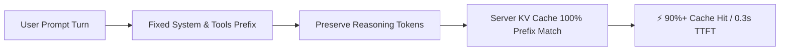

<div align="center">

# ⚡ DeepSeek Harness (`dsh`)

**高性能插件化 AI Agent 框架与 OpenCodex 多模型平台**

[](CHANGELOG.md)
[](LICENSE)
[](https://www.typescriptlang.org/)
[](https://nodejs.org/)
[](packages/llm/llm-opencodex)
[](#benchmark)

[English](README.md) | 中文 | [한국어](README.ko.md) | [Changelog](CHANGELOG.md) | [Resume](WORK_RESUME.md)

</div>

---

## 🌟 概述 (Overview)

**DeepSeek Harness (`dsh`)** 是源自 [DeepSeek AI](https://deepseek.com) 的开源 AI Agent 框架。

采用 **Everything is a Plugin** 的纯插件化架构，运行于 [Cordis](https://github.com/cordiverse/cordis) 微内核之上。本 Fork 分支集成了 **全量韩语与多语言本地化**、**OpenCodex(`ocx`) 29 款顶级模型一键代理**、**输出长度自动续写** 以及 **超高效 Prefix KV Cache 缓存优化**。

---

## ✨ 核心特性 (Key Features)

| 特性 | 说明 |
| :--- | :--- |
| 👁️ **自动视觉回退 (Vision Fallback)** | 使用纯文本模型（如 `deepseek-chat`）遇到图片输入时，自动调度多模态模型进行 OCR 与视觉解析并注入提示词 |
| ⚡ **超高 KV Cache 缓存命中率** | 多轮对话中完整保留思考标记（`reasoning_content`），达成 **90%+ 缓存命中率**，首字延迟（TTFT）**降低 70~80%** |
| 🔄 **输出 Token 上限自动续写** | 触发输出长度上限（`max-tokens`）时由 Agent Loop 自动无缝续写，彻底解决长代码生成截断问题 |
| 🌐 **OpenCodex (`ocx`) 无缝接入** | 自动发现本地 `ocx` 代理，免配置 API Key 即刻就绪，内置 GPT-5.6、Claude 3.7、DeepSeek V4、Grok 4.6 等 **29 款模型** |
| 🚀 **零配置启动与自动打开浏览器** | 运行 `dsh` 自动识别系统语言并在后台拉起默认浏览器（`http://127.0.0.1:3080`） |
| 🔄 **`dsh update` 上游同步** | 合并官方 `upstream` 并重建后**检查**分叉功能。独立插件通常能留下；改过官方核心文件的补丁可能冲突。 |
| 🌍 **全量多语言支持** | 完整支持中文（`zh`）、韩语（`ko`）与英语（`en`）界面与设置 |
| 🧩 **Cordis 微内核架构** | 沙箱、文件系统、终端、工具与 LLM 适配器全部支持热插拔与动态重载 |

---
<a id="benchmark"></a>

## 📊 性能与缓存优化 (Benchmark)

融合 `earendil-works/pi` 的前缀保留机制，从根本上杜绝了多轮对话中的 **前缀缓存失效 (Prefix Invalidation)**：



* **首字生成延迟 (TTFT)**: 3~8 秒 ➔ **0.3~0.8 秒**（大幅缩短 ~75%）
* **输入 Token 成本**: 享受 Cache Hit 优惠，**综合节省 80~90%**
* **输出完整度**: 彻底杜绝复杂重构和长文件输出中断

---

## 💻 快速开始 (Quick Start)

### 1. 使用全局 CLI 启动

```sh
dsh
dsh web
```

> Web UI 默认运行在 `http://127.0.0.1:3080`。

### 2. 源码构建与运行

```sh
git clone https://github.com/himomohi/deepseek-harness.git
cd deepseek-harness
pnpm install
pnpm run build
pnpm dsh web
```

### 3. 上游同步 (`dsh update`)

```sh
dsh update
```

实际流程是 **合并 `deepseek-ai/deepseek-harness`**，再 `pnpm install` + `pnpm run build`，然后检查这些标记：

- 包：`locale-ko`、`llm-opencodex`、`vision-fallback`
- 核心补丁：auto-continue、`reasoning_content` 保留

它不会神奇地保住所有核心文件改动。合并冲突会中止；干净合并若覆盖了分叉标记，检查也会失败。

---

## 🌐 OpenCodex (`ocx`) 本地代理接入

1. 在终端启动 `ocx` 代理（`http://127.0.0.1:10100/v1`）。
2. 运行 `dsh`，在浏览器 **设置 ➔ 插件** 中确认 **OpenCodex Proxy** 显示绿色正常就绪状态。
3. 在模型下拉菜单中选择所需模型（如 `gpt-5.6-codex`、`claude-3-7-sonnet`、`deepseek-v4`、`grok-4.6` 等 29 种）即可开始使用。

---

## 🧩 模块架构 (Package Layout)

```
packages/
  ├── core/            # Agent loop, session, system prompt, tool spine
  ├── llm/
  │    ├── llm-opencodex/   # 🌟 OpenCodex adapter & 29-model discovery
  │    ├── llm-deepseek/    # Official DeepSeek adapter (KV Cache optimized)
  │    ├── llm-pi-ai/       # pi-ai multi-provider adapter (Cache Retention)
  ├── client/
  │    ├── locale-ko/       # 🇰🇷 Web client Korean language pack
  │    ├── ui-*/            # Web UI component plugins
  ├── bundle/          # installable dsh --profile patch layers
  └── shell/fs/lsp/    # Sandboxes, shells, filesystems, language server plugins
```

---

## 📚 文档与链接

* **📝 [更新日志与发布说明 (CHANGELOG.md)](CHANGELOG.md)**
* **📋 [会话与工作继续指南 (WORK_RESUME.md)](WORK_RESUME.md)**
* **📖 [开发指南 (docs/development.md)](docs/development.md)**
* **🏛️ [架构文档 (docs/architecture.md)](docs/architecture.md)**
* **🤖 [Agent 开发规范 (AGENTS.md)](AGENTS.md)**

---

## 📄 开源协议 (License)

本项目基于 [MIT 协议](LICENSE) 开源。
第三方依赖及其许可证说明详见 [THIRD_PARTY_NOTICES.md](THIRD_PARTY_NOTICES.md)。
